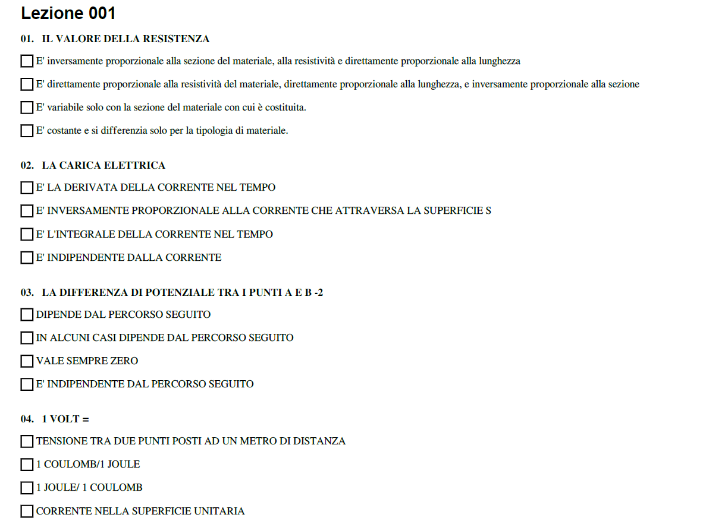
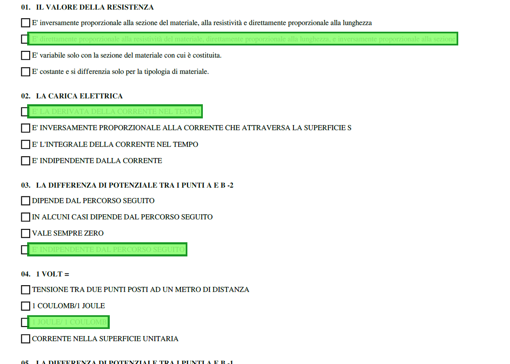
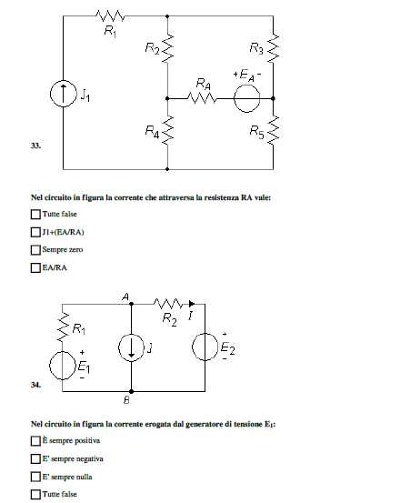
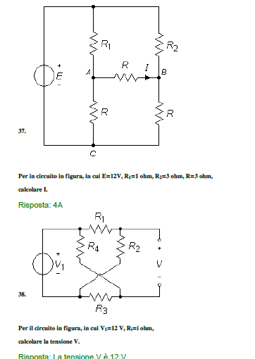

# pdfVision

**pdfVision** is a Python CLI pipeline that ingests multiple-choice quiz PDFs, infers the correct option (A–D) per question using pluggable LLM backends, and emits an annotated PDF plus structured JSON. It is designed for technical exam-style documents that mix text and figures: embedded images are detected per page, linked to nearby questions, and passed to vision-capable models when policy allows.

---

## What it does

1. **Extract** text with bounding boxes (PyMuPDF) and enumerate image regions per page.  
2. **Segment** numbered questions and four option lines (heuristics tuned for typical Italian MCQ layout).  
3. **Link** each question to the most plausible figure on the same page (layout heuristic: figure above question text, or nearest figure).  
4. **Solve** each MCQ via OpenAI-compatible API, Google Gemini, or local **Ollama** (text + optional PNG: full page or per-image crop).  
5. **Annotate** the PDF using **Square** annotations (green highlight on the correct line; optional strike-through styling for wrong options) so marks remain visible in common viewers (e.g. Adobe Reader, Edge).  
6. **Write** `*.answers.json` with answers, confidence, rationale, page metadata, and image-linking info.

---

## Examples (input vs output)

Screenshots below show two example page fragments **before** and **after** processing (same viewport).

| Input | Output (annotated) |
|------|---------------------|
|  |  |
|  |  |

> *Figures are representative. The repository does not ship third-party exam PDFs; add your own document locally.*

---

## Requirements

- Python **3.10+** (tested on 3.14).  
- Dependencies: see [`requirements.txt`](requirements.txt) (PyMuPDF, Pillow, Pydantic, Tenacity, OpenAI SDK, Ollama client, Google GenAI SDK).

### Install

```bash
python -m venv .venv
.venv\Scripts\activate   # Windows
pip install -r requirements.txt
```

Set API keys as needed:

| Backend | Environment / flag |
|---------|---------------------|
| Gemini | `GEMINI_API_KEY` or `GOOGLE_API_KEY`, or `--gemini-key` |
| OpenAI | `OPENAI_API_KEY` or `--api-key` |
| Ollama | default `http://localhost:11434`, or `--ollama-host` |

---

## Usage

```bash
python run.py --in QUIZ.pdf --out annotated.pdf [--pages 1-5] [--verbose] [--backend gemini|local|api] [--model MODEL]
```

**Notable flags**

| Flag | Purpose |
|------|---------|
| `--pages` | 1-based page range (omit for all pages). |
| `--image-policy auto\|always\|never` | Control when page/crop images are sent to the model. |
| `--mode highlight_correct\|strike_wrong` | Green mark on correct only, or green + strike styling on distractors. |
| `--from-answers PATH` | Regenerate PDF from a saved `*.answers.json` without inference. |
| `--skip-solve` | Extract/segment/render only (debug). |
| `--min-request-interval SEC` | Throttle requests (default ~13s for Gemini when unset). |

**Ollama quality note:** models may return JSON wrapped in markdown fences; the local solver strips fences before validation.

**Optional benchmark** (local latency):

```bash
python scripts/benchmark_ollama.py
```
## Project layout

```
pdfVision/
  run.py              # CLI entry
  src/
    pdf_extract.py    # Text lines, image regions, PNG export
    question_segment.py
    image_link.py     # Question ↔ figure index
    annotate_pdf.py   # Square annotations + wrap_contents
    solver/           # api, gemini, local (Ollama)
  scripts/
    benchmark_ollama.py
```

---


## License

See [LICENSE](LICENSE).
